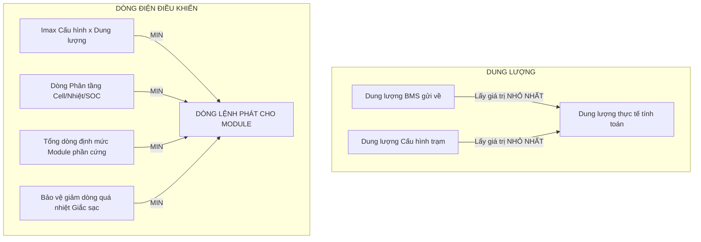
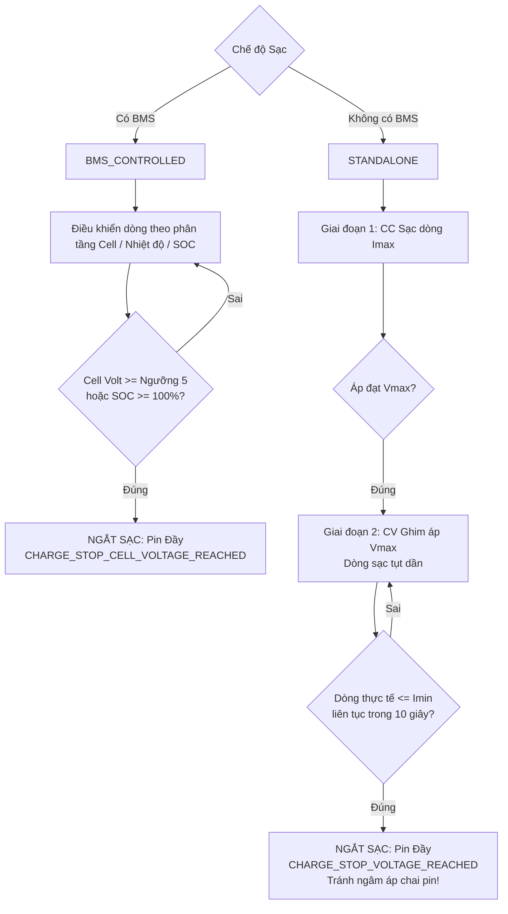
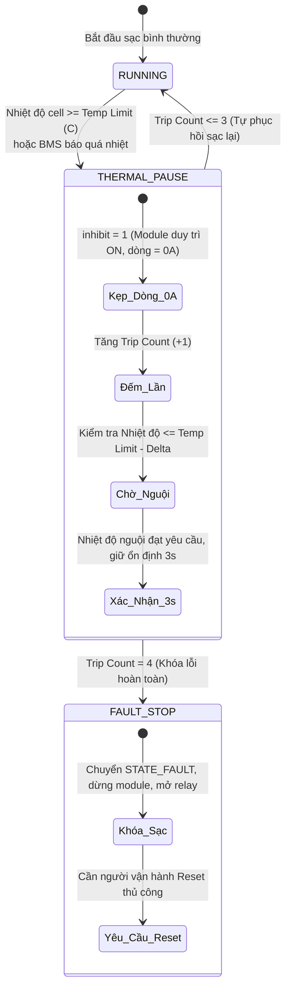

# TÀI LIỆU KỸ THUẬT: TỔNG HỢP TOÀN BỘ THÔNG SỐ CẤU HÌNH VÀ LOGIC ĐIỀU KHIỂN SẠC
**Dự án:** Hệ thống Điều khiển Trạm Sạc Xe Điện (Charger Controller)  
**Phiên bản tài liệu:** 2.1 (Đầy đủ 100% danh mục thông số, cấu trúc nhị phân và logic vận hành)  
**Ngày cập nhật:** 19/09/2026  
**Đối tượng áp dụng:** Kỹ sư hệ thống, Đội ngũ phát triển phần mềm, Khách hàng & Đối tác kỹ thuật  

---

## MỤC LỤC
1. [Tổng quan kiến trúc điều khiển sạc](#1-tổng-quan-kiến-trúc-điều-khiển-sạc)
2. [Bảng danh mục toàn bộ 100% thông số cấu hình](#2-bảng-danh-mục-toàn-bộ-100-thông-số-cấu-hình)
   - [2.1 Nhóm Thông số Pack Pin (General Limits & Pack Parameters)](#21-nhóm-thông-số-pack-pin-general-limits--pack-parameters)
   - [2.2 Nhóm Thông số Module Sạc Phần Cứng (Hardware Settings)](#22-nhóm-thông-số-module-sạc-phần-cứng-hardware-settings)
   - [2.3 Nhóm Phân Tầng Điện Áp Cell (Cell Voltage Stages)](#23-nhóm-phân-tầng-điện-áp-cell-cell-voltage-stages)
   - [2.4 Nhóm Phân Tầng Nhiệt Độ Cell (Temperature Stages)](#24-nhóm-phân-tầng-nhiệt-độ-cell-temperature-stages)
   - [2.5 Nhóm Phân Tầng Dung Lượng SOC (SOC Stages)](#25-nhóm-phân-tầng-dung-lượng-soc-soc-stages)
   - [2.6 Nhóm Bảo Vệ Điện Áp Giắc Sạc (Charge Jack Voltage Protection)](#26-nhóm-bảo-vệ-điện-áp-giắc-sạc-charge-jack-voltage-protection)
   - [2.7 Nhóm Bảo Vệ Quá Nhiệt Giắc Sạc (Jack Temperature Protection)](#27-nhóm-bảo-vệ-quá-nhiệt-giắc-sạc-jack-temperature-protection)
   - [2.8 Nhóm Chế Độ Sạc Kép & Hẹn Giờ Sạc (Dual Profiles & Delay Charge)](#28-nhóm-chế-độ-sạc-kép--hẹn-giờ-sạc-dual-profiles--delay-charge)
   - [2.9 Nhóm Định Danh & Bảo Mật Hệ Thống (Identity & Security)](#29-nhóm-định-danh--bảo-mật-hệ-thống-identity--security)
3. [Quy luật Max/Min & Thứ tự ưu tiên điều khiển dòng – áp](#3-quy-luật-maxmin--thứ-tự-ưu-tiên-điều-khiển-dòng--áp)
4. [Kiến trúc 3 vùng điện áp bảo vệ pin (E022 & E001)](#4-kiến-trúc-3-vùng-điện-áp-bảo-vệ-pin-e022--e001)
5. [Logic sạc & Cơ chế ngắt sạc: Có BMS vs Không có BMS](#5-logic-sạc--cơ-chế-ngắt-sạc-có-bms-vs-không-có-bms)
6. [Cơ chế bảo vệ quá nhiệt & Giới hạn nhiệt độ Temp Limit (C)](#6-cơ-chế-bảo-vệ-quá-nhiệt--giới-hạn-nhiệt-độ-temp-limit-c)
7. [Bảng đối chiếu & Phân loại mã lỗi bảo vệ liên quan](#7-bảng-đối-chiếu--phân-loại-mã-lỗi-bảo-vệ-liên-quan)

---

## 1. TỔNG QUAN KIẾN TRÚC ĐIỀU KHIỂN SẠC

Hệ thống điều khiển trạm sạc gồm 3 thành phần chính:
- **Bộ điều khiển trung tâm (MCU STM32G0B1)**: Quản lý máy trạng thái (FSM), giao tiếp CAN với module sạc (Maxwell, Tonhe, Lianming) và BMS xe, bảo vệ an toàn, tính toán thông số thời gian thực.
- **Phần mềm giám sát PC (C# WPF - ChargerAppPC)**: Cấu hình tham số, giám sát đồ thị, quản lý profile pin.
- **Màn hình giao tiếp người dùng HMI DWIN**: Hiển thị trạng thái vận hành, thông số điện áp/dòng điện/SOC, cảnh báo mã lỗi.

---

## 2. BẢNG DANH MỤC TOÀN BỘ 100% THÔNG SỐ CẤU HÌNH

Cấu trúc cấu hình `ChargeCycleConfig_t` có kích thước cố định **249 bytes** lưu trong Flash/EEPROM, tương thích chuẩn giao tiếp PC và DWIN:

### 2.1 Nhóm Thông số Pack Pin (General Limits & Pack Parameters)

Khung cấu hình này tương ứng trực tiếp với 2 nhóm **Pack Parameters** (6 ô nhập liệu) và **Charge Window** (2 ô nhập liệu) trên giao diện cấu hình PC:

| Tên biến code | Nhãn hiển thị UI | Đơn vị | Dải giá trị | Giá trị mặc định | Vị trí trên UI | Ý nghĩa & Quy luật điều khiển |
| :--- | :--- | :---: | :---: | :---: | :---: | :--- |
| `battery_capacity_ah` | **Battery Cap (Ah)** | Ah | $1.0 \sim 2000.0$ | `100.0` | Pack Parameters | Dung lượng định mức của bộ pin. Làm chuẩn tính toán dòng sạc theo tỷ lệ C-rate ($I = C \times \text{Capacity}$). |
| `temp_limit_c` | **Temp Limit (C)** | °C | $20.0 \sim 85.0$ | `55.0` | Pack Parameters | **Ngưỡng nhiệt độ tới hạn bảo vệ pack pin**. Tự phục hồi 3 lần (sau khi nguội $\le \text{Temp Limit} - \Delta$), lần thứ 4 ngắt chuyển `FAULT`. |
| `vmin_v` | **V Min (V)** | V | $0.0 \sim 1000.0$ | `32.0` | Pack Parameters | Ngưỡng điện áp sàn cho phép sạc thường. Nếu $V_{\text{batt}} < V_{\min}$ ở chế độ thường $\rightarrow$ Báo lỗi `E001` (Dừng sạc). |
| `vmax_v` | **V Max (V)** | V | $0.0 \sim 1000.0$ | `58.4` | Pack Parameters | Ngưỡng điện áp sạc cao nhất của khối pin. Là điện áp đặt trong giai đoạn CV. |
| `imin_c` | **I Min (C)** | C-rate | $0.01 \sim 1.0$ | `0.1` | Pack Parameters | **DÒNG CẮT SẠC (Cut-off Current) khi KHÔNG CÓ BMS**. Khi áp đạt $V_{\max}$ và dòng thực tế $\le I_{\min}$ liên tục 10s $\rightarrow$ Ngắt sạc (Pin đầy). |
| `imax_c` | **I Max (C)** | C-rate | $0.01 \sim 5.0$ | `1.0` | Pack Parameters | Giới hạn dòng sạc trần trong giai đoạn sạc nhanh CC ($I_{\max} = imax\_c \times \text{Capacity}$). |
| `vlow_v` | **V Low (V)** | V | $0.0 \sim 1000.0$ | `52.0` | Charge Window | Điện áp mục tiêu áp dụng cho phiên sạc kích hoạt sớm (`PRECHARGE`) hoặc sạc chậm ban đầu. |
| `ilow_c` | **I Low (C)** | C-rate | $0.01 \sim 1.0$ | `0.5` | Charge Window | Dòng sạc áp dụng cho phiên sạc kích hoạt sớm (`PRECHARGE`) ($I_{\text{low}} = ilow\_c \times \text{Capacity}$). |
| `vpre_v` | *V Precharge (V)* | V | $0.0 \sim 1000.0$ | `48.0` | *(Ẩn trên UI)* | Giữ trong cấu trúc nhị phân để tương thích ngược, giá trị được đồng bộ theo `vlow_v`. |
| `ipre_c` | *I Precharge (C)* | C-rate | $0.01 \sim 1.0$ | `0.2` | *(Ẩn trên UI)* | Giữ trong cấu trúc nhị phân để tương thích ngược, giá trị được đồng bộ theo `ilow_c`. |

---

### 2.2 Nhóm Thông số Module Sạc & Ánh Xạ Hệ Thống (Hardware & System Mapping)

Khung cấu hình này tương ứng với 2 nhóm **System Mapping** (3 ô nhập liệu) và **Charger Module Envelope** (7 ô nhập liệu) trên giao diện PC:

| Tên biến code | Nhãn hiển thị UI | Đơn vị | Dải giá trị | Giá trị mặc định | Vị trí trên UI | Ý nghĩa & Quy luật điều khiển |
| :--- | :--- | :---: | :---: | :---: | :---: | :--- |
| `admin_pin` | **Admin PIN** | uint32 | `000000`..`999999` | `123456` | System Mapping | Mã PIN bảo mật 6 chữ số để mở khóa trang cấu hình chuyên sâu trên màn hình HMI DWIN. |
| `can_battery_id` | **BMS CAN ID** | Hex | `0x00000000`..`0x1FFFFFFF` | `0x00000000` | System Mapping | Địa chỉ CAN ID nhận dạng bản tin BMS. **Được bảo toàn nguyên vẹn trên UI và Firmware**. |
| `charge_source_mode` | **Charge Source** | Enum | 0..1 | `BMS Controlled` | System Mapping | Chế độ sạc nguồn: `0: BMS Controlled` (Có BMS), `1: Standalone` (Không BMS). |
| `module_type` | **Module Type** | Enum | 1..4 | `TONHE` | Module Envelope | Loại giao thức module: `1: EVR`, `2: Maxwell`, `3: Lianming`, `4: Tonhe`. |
| `source_module_count` | **Source Modules** | Cái | $1 \sim 8$ | `1` | Module Envelope | Số module sạc thực tế lắp trong tủ trạm. Dùng chia dòng cho từng module. |
| `module_address` | **Address Module** | uint8 | $1 \sim 255$ | `1` | Module Envelope | **Địa chỉ CAN bus của Module sạc**. Xác định địa chỉ trạm gọi lệnh tới module. |
| `module_u_min_v` | **U Min (V)** | V | $0.0 \sim 1000.0$ | `30.0` | Module Envelope | Giới hạn điện áp phát nhỏ nhất của module phần cứng. |
| `module_u_max_v` | **U Max (V)** | V | $0.0 \sim 1000.0$ | `99.0` | Module Envelope | Giới hạn điện áp phát lớn nhất của module phần cứng. Điện áp lệnh không bao giờ vượt qua mức này. |
| `module_i_min_a` | **I Min (A)** | A | $0.1 \sim 100.0$ | `5.0` | Module Envelope | Giới hạn dòng phát nhỏ nhất của 1 module (dưới mức này module không phát xung ổn định). |
| `module_i_max_a` | **I Max (A)** | A | $1.0 \sim 500.0$ | `100.0` | Module Envelope | Dòng điện tối đa của 1 module phần cứng. |

---

### 2.3 Nhóm Phân Tầng Điện Áp Cell (Cell Voltage Stages)

Áp dụng trong chế độ có BMS. Cho phép giảm dần dòng nạp khi cell pin tiệm cận trạng thái đầy để cân bằng cell và chống quá nhiệt.

| Tên biến code | Nhãn hiển thị UI | Đơn vị | Giá trị mặc định | Ý nghĩa & Quy luật điều khiển |
| :--- | :--- | :---: | :---: | :--- |
| `cell_volt_enabled` | **Cell Volt Enabled** | 0 / 1 | `1` (Bật) | Bật/Tắt tính năng điều khiển dòng theo điện áp cell. |
| `cell_volt_delta_t_s` | **Delta t (s)** | Giây | `0.0` | Thời gian lọc nhiễu (debounce) khi chuyển tầng điện áp cell. Phải duy trì ổn định quá thời gian này mới chuyển tầng. |
| `cell_volt_1_v` .. `4_v` | **Cell Vol 1..4 (V)** | V | 3.00, 3.30, 3.50, 3.65 | 4 mốc điện áp cell tăng dần. |
| `cell_volt_5_v` | **Cell Vol 5 (V)** | V | `3.80` | **NGƯỠNG NGẮT SẠC PIN ĐẦY**. Bất kỳ cell nào chạm ngưỡng này $\rightarrow$ Dừng sạc (`CHARGE_STOP_CELL_VOLTAGE_REACHED`). |
| `cell_curr_1_c` .. `4_c` | **Current 1..4 (C)** | C-rate | 1.00, 0.70, 0.40, 0.20 | Dòng sạc tương ứng với từng khoảng điện áp cell. Dòng giảm dần khi cell lên cao. |

---

### 2.4 Nhóm Phân Tầng Nhiệt Độ Cell (Temperature Stages)

| Tên biến code | Nhãn hiển thị UI | Đơn vị | Giá trị mặc định | Ý nghĩa & Quy luật điều khiển |
| :--- | :--- | :---: | :---: | :--- |
| `temp_enabled` | **Temp Enabled** | 0 / 1 | `0` (Tắt) | Bật/Tắt tính năng giới hạn dòng theo nhiệt độ cell pin. |
| `temp_delta_c` | **Delta (C)** | °C | `3.0` | Độ trễ nhiệt độ (Hysteresis) cần thiết để phục hồi lên tầng dòng cao hơn khi pin nguội. |
| `temp_1_c` .. `5_c` | **Temperature 1..5 (C)** | °C | 10.0, 20.0, 40.0, 50.0, 60.0 | 5 mốc nhiệt độ cell. Vượt ngưỡng 5 (`temp_5_c`) kích hoạt kẹp dòng về 0A (`inhibit = 1`). |
| `temp_curr_1_c` .. `4_c` | **Current 1..4 (C)** | C-rate | 0.2, 0.5, 1.0, 0.3 | Dòng sạc tối đa cho phép tương ứng với từng khoảng nhiệt độ môi trường/cell. |
| `temp_limit_c` | **Temp Limit (C)** | °C | `55.0` | **Ngưỡng nhiệt độ tới hạn bảo vệ trạm sạc**. Tự phục hồi 3 lần, lần thứ 4 ngắt hoàn toàn chuyển `FAULT`. |

---

### 2.5 Nhóm Phân Tầng Dung Lượng SOC (SOC Stages)

| Tên biến code | Nhãn hiển thị UI | Đơn vị | Giá trị mặc định | Ý nghĩa & Quy luật điều khiển |
| :--- | :--- | :---: | :---: | :--- |
| `soc_enabled` | **SOC Enabled** | 0 / 1 | `0` (Tắt) | Bật/Tắt tính năng giới hạn dòng theo mức dung lượng % SOC từ BMS. |
| `soc_delta_t_s` | **Delta t (s)** | Giây | `0.0` | Thời gian lọc nhiễu chuyển tầng SOC. |
| `soc_1_pct` .. `4_pct` | **SOC 1..4 (%)** | % | 20.0, 50.0, 80.0, 90.0 | 4 mốc SOC tăng dần. |
| `soc_5_pct` | **SOC 5 (%)** | % | `100.0` | **Ngưỡng ngắt sạc khi SOC đầy 100%**. Kích hoạt dừng sạc (`CHARGE_STOP_SOC_REACHED`). |
| `soc_curr_1_c` .. `4_c` | **Current 1..4 (C)** | C-rate | 1.0, 0.8, 0.5, 0.2 | Dòng sạc tương ứng với từng khoảng dung lượng SOC. |

---

### 2.6 Nhóm Bảo Vệ Điện Áp Giắc Sạc (Charge Jack Voltage Protection)

Ngăn chặn hiện tượng tiếp xúc kém, lỏng đầu cắm sạc hoặc chập đứt dây DC gây sụt áp nguy hiểm và sinh nhiệt cao tại tiếp điểm.

| Tên biến code | Nhãn hiển thị UI | Đơn vị | Giá trị mặc định | Ý nghĩa & Quy luật điều khiển |
| :--- | :--- | :---: | :---: | :--- |
| `protect_jack_charge_enabled` | **Jack Charge Enabled** | 0 / 1 | `0` (Tắt) | Bật/Tắt tính năng bảo vệ sụt áp giắc sạc. |
| `protect_jack_charge_delta_v` | **Delta V (V)** | V | `2.0` | Độ chênh lệch áp tối đa cho phép: $\Delta V = \|V_{\text{module}} - V_{\text{batt}}\|$. Nếu $\Delta V > \text{Delta V}$ khi đang có tải $\ge 2.0\text{A}$ $\rightarrow$ Kích hoạt đếm lỗi. |
| `protect_jack_charge_delay_s` | **Delay (s)** | Giây | `5` | Thời gian duy trì lệch áp liên tục trước khi ngắt sạc khẩn cấp báo lỗi **`E030`** (`ALARM_ACT_STOP`). |

---

### 2.7 Nhóm Bảo Vệ Quá Nhiệt Giắc Sạc (Jack Temperature Protection)

Giám sát trực tiếp 4 kênh cảm biến nhiệt độ NTC gắn tại đầu súng sạc / giắc cắm DC của trạm sạc.

| Tên biến code | Nhãn hiển thị UI | Đơn vị | Giá trị mặc định | Ý nghĩa & Quy luật điều khiển |
| :--- | :--- | :---: | :---: | :--- |
| `protect_jack_temp_enabled` | **Jack Temp Enabled** | 0 / 1 | `0` (Tắt) | Bật/Tắt tính năng bảo vệ nhiệt độ giắc sạc. |
| `protect_jack_temp_threshold_c` | **Threshold (C)** | °C | `70.0` | Ngưỡng nhiệt độ bắt đầu kích hoạt **Giảm công suất mềm (Soft Derating)** để hạ nhiệt giắc. |
| `protect_jack_temp_delta_c` | **Delta (C)** | °C | `5.0` | Độ nguội cần thiết ($T \le \text{Threshold} - \text{Delta}$) để khôi phục lại 100% công suất sạc. |
| `protect_jack_temp_delay_s` | **Delay (s)** | Giây | `3` | Thời gian trễ lọc nhiễu nhiệt độ trước khi kích hoạt/phục hồi derating. |
| `protect_jack_temp_power_limit_pct` | **Power Limit (%)** | % | `80.0` | Tỷ lệ công suất tối đa cho phép khi đang bị giới hạn nhiệt giắc (ví dụ giảm còn 80% công suất). |
| `protect_jack_temp_trip_c` | **Trip Temp (C)** | °C | `75.0` | **Ngưỡng ngắt khẩn cấp cứng (Hard Protection Trip)**. Vượt ngưỡng này ngắt sạc lập tức báo lỗi `E031`. |

---

### 2.8 Nhóm Chế Độ Sạc Kép & Hẹn Giờ Sạc (Dual Profiles & Delay Charge trên DWIN Pages 08..11 & PC Toolbar)

Hệ thống quản lý 2 bộ thông số cấu hình riêng biệt (`FAST` và `NORMAL`), hỗ trợ tính năng hẹn giờ sạc lùi thời điểm:

| Tên biến code | Nhãn hiển thị UI / DWIN | Đơn vị | Giá trị mặc định | Vị trí hiển thị | Ý nghĩa & Quy luật điều khiển |
| :--- | :--- | :---: | :---: | :---: | :--- |
| `charge_mode` | **Profile: Fast / Normal** | Enum | `0: FAST` | Toolbar PC & DWIN P8-11 | Bộ cấu hình tích cực: `0: FAST` (Sạc nhanh), `1: NORMAL` (Sạc tiêu chuẩn). Chuyển đổi linh hoạt giữa 2 bộ profile độc lập. |
| `delay_enabled` | **Delay Enabled (Bật/Tắt)** | 0 / 1 | `0` (Tắt) | DWIN P8-11 / Flash | Bật/Tắt tính năng hẹn giờ lùi thời điểm bắt đầu sạc (phù hợp sạc đêm giờ thấp điểm). |
| `delay_hours` | **Delay Hours (Giờ)** | Giờ | `2` | DWIN `0x1600` | Số giờ đếm ngược chờ sạc ($0 \sim 99$ giờ). |
| `delay_minutes` | **Delay Minutes (Phút)** | Phút | `30` | DWIN `0x1601` | Số phút đếm ngược chờ sạc ($0 \sim 59$ phút). |

---

### 2.9 Nhóm Định Danh & Thông Số Trạm (Identity & Setting trên Màn DWIN Page 02)

Các thông số này được hiển thị trên **Trang Cài Đặt (Setting - Page 02)** của màn hình cảm ứng HMI DWIN trên trạm sạc:

| Tên biến code / VP | Nhãn hiển thị DWIN | Kiểu dữ liệu | Giá trị mặc định | Vị trí / VP Address | Ý nghĩa & Quy luật điều khiển |
| :--- | :--- | :---: | :---: | :---: | :--- |
| `admin_pin` | **Admin PIN** | uint32 | `123456` | Flash / Page 06 | Mã PIN bảo mật 6 chữ số để mở khóa trang cấu hình chuyên sâu và sạc kích hoạt. |
| `device_id` | **Device ID** | char[16] | `"PKG-0001"` | `0x1110` (8 chars) | Chuỗi định danh trạm sạc (Mã trạm sạc lưu trong Flash, hiển thị trên DWIN). |
| `hw_rev` | **HW Rev** | char[12] | `"V1.0.0"` | `0x1100` (8 chars) | Chuỗi phiên bản thiết kế phần cứng của trạm sạc (chuẩn định dạng `Vx.y.z`). |
| `fw_rev` | **FW Rev** | char[12] | `"V2.0.0"` | `0x1108` (8 chars) | Chuỗi phiên bản Firmware vi điều khiển MCU đang chạy (chuẩn định dạng `Vx.y.z`). |
| `total_charged` | **Total Charged** | string (Ah) | `"0.0 Ah"` | `0x1118` (16 chars) | Tổng dung lượng tích lũy trạm đã nạp cho các phiên sạc. |
| `total_energy` | **Total Energy** | string (kWh) | `"0.0 kWh"` | `0x1120` (16 chars) | Tổng điện năng tiêu thụ tích lũy của trạm sạc. |
| `uptime` | **Uptime** | string (HHH:MM:SS) | `"000:00:00"` | `0x1128` (16 chars) | Tổng thời gian hoạt động liên tục của trạm từ khi cấp nguồn. |

---

## 3. QUY LUẬT MAX/MIN & THỨ TỰ ƯU TIÊN ĐIỀU KHIỂN DÒNG – ÁP

Để đảm bảo an toàn tuyệt đối trong mọi tình huống vận hành, hệ thống tuân theo các quy luật trọng tài (Arbitration Rules) chặt chẽ:



### 3.1 Quy luật xác định Dung lượng pin (Battery Capacity)
$$\text{Dung lượng thực tế } C_{\text{calc}} = \min \Big( \text{Dung lượng BMS đo được}, \; \text{Dung lượng khai báo cấu hình} \Big)$$
*Ý nghĩa:* Ngăn chặn trường hợp thông số BMS khai khống dung lượng lớn hơn thực tế khiến trạm sạc bơm dòng quá mức chịu đựng của pack pin.

### 3.2 Quy luật xác định Dòng sạc Lệnh (Target Current)
Dòng sạc cấp cho hệ thống luôn lấy theo **giá trị nhỏ nhất (MIN)** từ tất cả các ràng buộc bảo vệ:
$$I_{\text{target}} = \min \begin{cases} 
I_{\max} = imax\_c \times C_{\text{calc}} \\
I_{\text{stage}} = \text{Dòng giới hạn phân tầng (Cell Volt, Temp, SOC)} \\
I_{\text{hardware}} = \text{module\_i\_max\_a} \times \text{actual\_module\_count} \\
I_{\text{derate}} = \text{Giảm dòng bảo vệ quá nhiệt giắc sạc (Jack Derating)}
\end{cases}$$

### 3.3 Quy luật xác định Điện áp sạc Lệnh (Target Voltage)
$$V_{\text{target}} = \min \Big( vmax\_v, \; \text{module\_u\_max\_v} \Big)$$
*Lưu ý an toàn:* Trong quá trình chưa đóng relay ngõ ra, điện áp module được khống chế bám sát điện áp thực của pack pin đo được từ BMS để triệt tiêu chênh áp, chống sốc dòng khi đóng tiếp điểm relay.

---

## 4. KIẾN TRÚC 3 VÙNG ĐIỆN ÁP BẢO VỆ PIN (E022 & E001)

Khi trạm sạc kết nối với pack pin ở chế độ có BMS (`BMS_CONTROLLED`), toàn bộ dải điện áp pin đo được được phân định thành **3 vùng an toàn**:

```
0V ----------------------- [ 0.5 x Vmax ] ----------------------- [ Vmin ] ----------------------- [ Vmax ] ---> (Volt)
|        VÙNG 1: KHÔNG CÓ PIN         |      VÙNG 2: ĐIỆN ÁP THẤP        |      VÙNG 3: SẠC BÌNH THƯỜNG        |
|  Báo E022 - DỪNG SẠC (STOP)        |  Báo E001 - DỪNG SẠC (STOP)      |  Cho phép khởi động chu trình sạc   |
|  (BMS offline hoặc hở cáp sạc)      |  (Được BYPASS trong PRECHARGE)   |                                     |
```

### Chi tiết hành vi từng vùng:

1. **VÙNG 1: $V_{\text{batt}} < 0.5 \times V_{\max} \rightarrow$ Mã lỗi `E022` (Không có PIN)**
   - **Hành vi**: `ALARM_ACT_STOP` (Ngắt sạc, không đóng relay).
   - **Bản chất**: Điện áp đo được quá thấp so với định mức pack, báo hiệu chưa cắm cáp sạc, cáp bị đứt ngầm, hoặc BMS bị khóa ngõ ra.
   
2. **VÙNG 2: $0.5 \times V_{\max} \le V_{\text{batt}} < V_{\min} \rightarrow$ Mã lỗi `E001` (Điện áp pin thấp)**
   - **Hành vi ở Chế độ Sạc Thường**: `ALARM_ACT_STOP` (Dừng sạc). Điện áp pin nằm dưới mức điện áp an toàn cho phép sạc dòng lớn thông thường.
   - **Hành vi ở Chế độ `PRECHARGE`**: **TỰ ĐỘNG BYPASS (Cho phép sạc)**. Trong trạng thái kích hoạt sớm, pin cạn kiệt được phép nhận dòng nhỏ ($I_{\text{low}}$) và áp an toàn ($V_{\text{low}}$) để nâng dần điện áp lên mà không bị ngắt lỗi ảo.
   
3. **VÙNG 3: $V_{\text{batt}} \ge V_{\min} \rightarrow$ Hoạt động bình thường**
   - Đủ điều kiện điện áp vận hành, chuyển sang chu trình sạc tiêu chuẩn.

---

## 5. LOGIC SẠC & CƠ CHẾ NGẮT SẠC: CÓ BMS VS KHÔNG CÓ BMS

Sự khác biệt căn bản giữa hai chế độ vận hành:



### 5.1 Khi CÓ BMS (`BMS_CONTROLLED`)
- **Nguyên tắc điều khiển**: Hệ thống hoàn toàn tin cậy vào giám sát từng cell của BMS.
- **Điều kiện ngắt sạc (Pin Đầy)**:
  1. Có ít nhất 1 cell pin đạt điện áp ngưỡng 5 (`cell_volt_5_v`) $\rightarrow$ Dừng sạc với lý do `CHARGE_STOP_CELL_VOLTAGE_REACHED`.
  2. Hoặc SOC đạt $100\%$ (`soc_5_pct`) $\rightarrow$ Dừng sạc với lý do `CHARGE_STOP_SOC_REACHED`.
  3. Hoặc BMS gửi cờ báo đầy / ngắt sạc qua CAN bus.
- **Vai trò của $I_{\min}$ (`imin_c`)**: **KHÔNG THAM GIA**. $I_{\min}$ tuyệt đối không được ép sàn dòng của các tầng cell, cho phép logic tầng hạ dòng xuống mức nhỏ nhất cần thiết để cân bằng cell.

### 5.2 Khi KHÔNG CÓ BMS (`STANDALONE` / Sạc độc lập)
- **Nguyên tắc điều khiển**: Không có dữ liệu từng cell, hệ thống vận hành theo chuẩn **CC-CV**.
  - Giai đoạn CC: Bơm dòng $I_{\max}$ đến khi áp chạm $V_{\max}$.
  - Giai đoạn CV: Giữ cố định áp $V_{\max}$, dòng sạc tự nhiên giảm dần khi pin no.
- **Vai trò cốt lõi của $I_{\min}$ (`imin_c`)**: Là **DÒNG CẮT SẠC (End-of-Charge Cut-off Current)**.
  - Khi pin ở vùng áp đỉnh bão hòa: $V_{\text{actual}} \ge (V_{\max} - 0.5\text{V})$.
  - Dòng điện thực tế tụt xuống mức: $I_{\text{actual}} \le I_{\min}$ ($imin\_c \times \text{Capacity}$).
  - Duy trì ổn định liên tục trong **10 giây**.
  - $\rightarrow$ Hệ thống kích hoạt dừng sạc dứt điểm (`CHARGE_STOP_VOLTAGE_REACHED`), **ngắt relay ngõ ra để bảo vệ pin khỏi bị ngâm áp cao liên tục (Floating overvoltage), chống chai pin và phồng cell**.

---

## 6. CƠ CHẾ BẢO VỆ QUÁ NHIỆT & GIỚI HẠN NHIỆT ĐỘ TEMP LIMIT (C)

Để bảo vệ khối pin chống hiện tượng thoát nhiệt (Thermal Runaway), hệ thống triển khai cơ chế bảo vệ nhiệt độ 2 lớp kết hợp tính năng **Tự phục hồi thông minh**:



### Quy trình chi tiết:
1. **Phát hiện quá nhiệt**: Khi nhiệt độ cell pin $\ge \text{Temp Limit (C)}$ (hoặc vượt ngưỡng tầng 5 `temp_5_c`, hoặc BMS gửi cờ cảnh báo `temp_cell_high_chg`):
   - Hệ thống phát lệnh kẹp dòng về **$0\text{A}$** ngay lập tức (`inhibit = 1`), vẫn giữ phiên sạc ở trạng thái `RUNNING`.
   - Ghi nhận 1 lần ngắt nhiệt (`bms_temp_trip_count` tăng thêm 1).
2. **Tự động phục hồi (Auto-Recovery)**:
   - Khi nhiệt độ cell nguội xuống dưới ngưỡng hysteresis:
     $$T_{\text{cell}} \le \Big( \text{Temp Limit} - \text{temp\_delta\_c} \Big)$$
   - Điều kiện nguội duy trì liên tục và ổn định trong **3.0 giây** kèm dữ liệu BMS tươi mới:
     $\rightarrow$ Hệ thống tự động xóa cờ `inhibit`, từ từ tăng dòng sạc (ramp up) tiếp tục chu trình sạc.
3. **Cơ chế Khóa an toàn lần thứ 4 (4th-Trip Lockout)**:
   - Nếu trong cùng một phiên sạc, hiện tượng quá nhiệt lặp lại đến **lần thứ 4** (`bms_temp_trip_count = 4`):
   - Hệ thống đánh giá khối pin hoặc môi trường tản nhiệt đang gặp sự cố nghiêm trọng, **chấm dứt tự phục hồi**, chuyển ngay sang trạng thái **`FAULT`** (`CHARGE_STOP_BMS_ALARM`), dừng hoàn toàn module sạc và ngắt relay tiếp điểm.
   - Muốn sạc lại bắt buộc người vận hành phải kiểm tra an toàn và thực hiện thao tác **Reset Fault**.

---

## 7. BẢNG ĐỐI CHIẾU & PHÂN LOẠI MÃ LỖI BẢO VỆ LIÊN QUAN

| Mã lỗi | Tên hiển thị DWIN | Cấp hành vi | Nguyên nhân kích hoạt | Cơ chế cô lập & Khử lỗi ảo |
| :---: | :--- | :---: | :--- | :--- |
| **`E001`** | **Điện áp pin thấp** | `ALARM_ACT_STOP` | Điện áp pack pin nằm trong khoảng $[0.5 \times V_{\max}, V_{\min})$ ở chế độ sạc thường, hoặc BMS gửi cờ `low_pack_volt`. | Tự động **BYPASS** (không báo lỗi, không ngắt sạc) khi đang trong phiên sạc `PRECHARGE`. |
| **`E022`** | **Không có PIN** | `ALARM_ACT_STOP` | Điện áp đo được $< 0.5 \times V_{\max}$ trong khi hệ thống đang ở chế độ sạc có BMS. | Phân định rạch ròi với E001; ngăn đóng relay sạc khi hở mạch cáp pin. |
| **`E005`** | **Pin quá nóng khi sạc** | `ALARM_ACT_INFO` (Lần 1-3)<br>$\rightarrow$ `ALARM_ACT_STOP` (Lần 4) | Nhiệt độ cell $\ge \text{Temp Limit (C)}$ hoặc BMS gửi cờ `temp_cell_high_chg`. | Tự động kẹp dòng về 0A, cho phép tự phục hồi tối đa 3 lần sau khi nguội; lần 4 ngắt hoàn toàn. |
| **`E003`** | **Điện áp pin cao** | `ALARM_ACT_STOP` | BMS gửi cờ quá áp pack pin `high_pack_volt`. | Ngắt sạc dừng module ngay lập tức. |
| **`E004`** | **Điện áp cell pin cao** | `ALARM_ACT_STOP` | BMS gửi cờ quá áp cell đơn lẻ `high_cell_volt`. | Ngắt sạc bảo vệ cell pin tránh nổ/phồng. |
| **`E023`** | **Mất tải DC** | `ALARM_ACT_STOP` | Dòng sạc thực tế sụt bất thường về $\approx 0\text{A}$ trong khi module đang phát áp cao. | Tự động vô hiệu hóa khi hệ thống đang chủ động kẹp dòng do quá nhiệt E005 (`inhibit = 1`), tránh báo lỗi ảo. |
| **`E030`** | **Sụt áp jack sạc** | `ALARM_ACT_STOP` | Chênh lệch điện áp đầu cắm $\Delta V = V_{\text{cap}} - V_{\text{batt}} > 2.0\text{V}$ khi đang có tải $\ge 2.0\text{A}$. | Chỉ đánh giá khi có dòng sạc thật; bỏ qua khi ngắt nhiệt E005 hoặc relay mở. |
| **`E031`** | **Quá nhiệt jack sạc** | `ALARM_ACT_STOP` | Nhiệt độ tại 4 kênh NTC giắc cắm vượt ngưỡng tới hạn `protect_jack_temp_trip_c`. | Dừng sạc khẩn cấp bảo vệ chống cháy nổ tiếp điểm đầu cắm. |

---

## 8. KẾT LUẬN & KIẾN NGHỊ BÀN GIAO

1. **Tính hoàn thiện**: Toàn bộ **48 trường thông số** cấu hình trong tài liệu này phản ánh chính xác 100% cấu trúc nhị phân 249 bytes của Firmware MCU STM32 và giao diện ứng dụng C# PC (`ChargerAppPC`).
2. **Tính thân thiện & Tinh gọn**: Giao diện người dùng PC đã loại bỏ các thông số thừa gây nhầm lẫn (`V Precharge`, `I Precharge`), trong khi vẫn giữ nguyên địa chỉ cấu hình `BMS CAN ID`.
3. **Tính an toàn tuyệt đối**: Hệ thống bao phủ toàn diện từ bảo vệ pin (3 vùng điện áp, ngắt bão hòa $I_{\min}$, quá nhiệt tự phục hồi 3 lần) đến bảo vệ hạ tầng trạm sạc (sụt áp giắc sạc, quá nhiệt đầu cắm 4 kênh NTC, hẹn giờ sạc thấp điểm).
